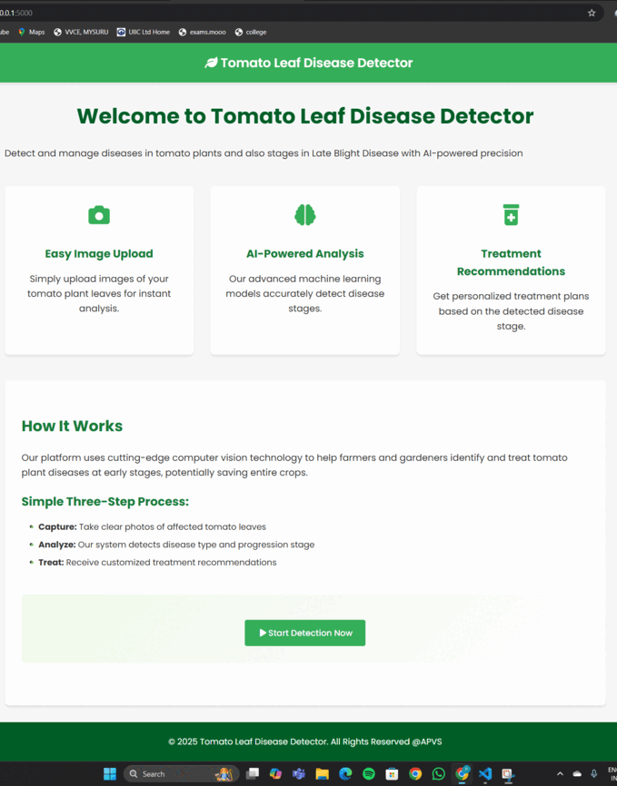

# 🍅 Stage-Wise LAte Blight Tomato Leaf Disease Detection Web App

This web-based application allows users to upload or capture images of tomato leaves to detect the disease stage using deep learning models (InceptionV3 and EfficientNet). It also provides treatment recommendations, stores history, generates downloadable PDF reports, and supports multi-image predictions.

---

## 🌐 Website Preview



---

## 👨‍💻 Team Members

- **Prajwal G S** – 4VV21IS075  
- **Aishwarya Deepak** – 4VV21IS004  
- **Varshini J** – 4VV21IS114  
- **Sharath Kumar K R** – 4VV21IS095  

**Guided by:** Dr. Ravi Kumar V, HOD, Dept. of ISE, VVCE

---

## 🚀 Features

- Upload or capture leaf images from webcam
- Detect Tomato Leaf Disease using trained models
- Detect tomato leaf disease stages using trained DL models (InceptionV3 & EfficientNet)
- Store prediction history in Firebase Firestore
- Download result as a structured PDF report (with images and timestamps)
- Stage-wise treatment and precaution guide section

---

### Objectives

- Develop a robust deep learning model to detect tomato leaf diseases with high accuracy.
- Implement stage-wise classification of Late Blight Disease for better treatment recommendations.
- Build a user-friendly web application for disease detection using single/multiple leaf images.
- Enable real-time predictions using local and Hugging Face-hosted models.
- Provide a downloadable, structured PDF report including predictions and treatment guidance.
- Allow users to track disease history through Firestore database integration.
- Support camera input and image uploads for flexibility in real-world scenarios.
- Enhance farmer decision-making by offering early detection and actionable treatment plans.

## 🛠️ Technologies Used

- **Frontend**: HTML, CSS, Jinja2 Templates
- **Backend**: Flask, Python
- **Deep Learning**: TensorFlow, Keras, EfficientNet, InceptionV3
- **Image Processing**: Pillow (PIL), OpenCV (for camera)
- **Cloud & Storage**: Firebase Firestore, Google Drive, gdown
- **PDF Reports**: ReportLab
- **Model Integration**: Hugging Face (transformers, AutoImageProcessor, AutoModelForImageClassification)

---

## 🖥️ System Requirements

### ✅ Software Requirements

| Component                | Version / Notes                                         |
|--------------------------|----------------------------------------------------------|
| **Operating System**     | Windows 10/11, Ubuntu 20.04+, macOS 10.15+              |
| **Python**               | Python 3.8 or above                                     |
| **Flask**                | 2.0+                                                    |
| **TensorFlow**           | 2.9+ (Used for model loading and inference)             |
| **Keras**                | Included with TensorFlow                               |
| **Firebase Admin SDK**   | Latest version (for authentication & Firestore access) |
| **Pillow (PIL)**         | For image loading and manipulation                     |
| **ReportLab**            | For generating downloadable PDF reports                |
| **Torch**                | Required for auxiliary model support (if used)         |
| **gdown**                | For downloading models from Google Drive               |
| **Jinja2**               | Template engine (bundled with Flask)                   |
| **Browser**              | Chrome, Firefox, or any modern browser                 |

All necessary packages are listed in the `requirements.txt`.

### 💾 Hardware Requirements

| Component                | Minimum                                                   |
|--------------------------|------------------------------------------------------------|
| **Processor**            | Dual-core CPU (Intel i3 or equivalent)                    |
| **RAM**                  | 4 GB (8 GB recommended for faster performance)            |
| **Storage**              | At least 1 GB free (for models, images, dependencies)     |
| **GPU (Optional)**       | NVIDIA GPU with CUDA support (for model training/fine-tuning) |
| **Camera**               | Webcam or mobile device camera for live capture          |

---

## 📁 Folder Structure

```
project/
├── static/
│   ├── style.css
│   └── images/
├── templates/
│   ├── index.html
│   ├── login.html
│   ├── multiple_result.html
│   └── ... 
├── app.py
├── requirements.txt=
└── Website.gif
```

---

## 🧠 Models Used

- **Inception V3**: Deep CNN architecture, used for initial classification experiments.
- **EfficientNet**: Optimized and highly accurate model used for stage-wise classification.
- **Hugging Face Transformers**: Used for image classification via pretrained models.

---

## 📜 License

© 2025 APVS — All rights reserved.

## ⚙️ Installation & Setup

### 1. Clone the repository

```bash
**Clone the repository**:

   ```bash
    git clone https://github.com/prajwalgs010103/Stagewise-LateBlight-Disease-Detection-in-Tomato-Plants-along-with-Treatment-Recommendation.git
    pip install -r requirements.txt
    python app.py

